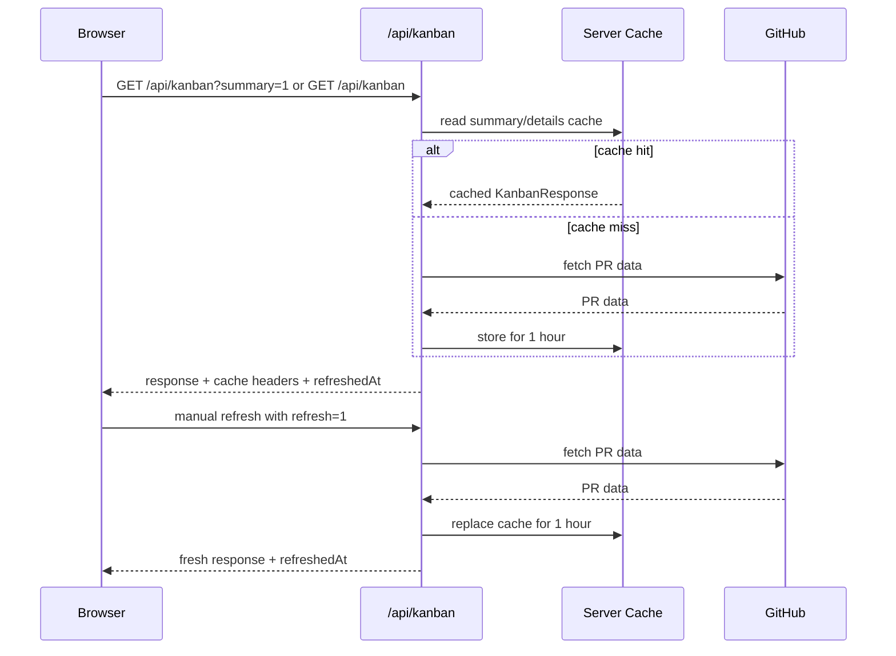

## Overview

改造 Kanban PR 数据刷新策略，降低 GitHub API 请求频率和 rate limit 风险。

目标：
- 前端普通页面刷新使用浏览器缓存，刷新页面时保留已有 PR 数据体验。
- 后端提供至少 1 小时的基础缓存，并记录数据刷新时间。
- 多个用户同时打开页面时共享后端缓存。
- 手动刷新仍然可以拉取最新数据并更新后端缓存。

范围：
- 修改 `/api/kanban` 的缓存策略和刷新参数。
- 修改 `KanbanPage` 的普通加载、自动刷新、手动刷新请求方式。
- 更新相关 route/client 测试。

开放问题：
- 浏览器缓存 TTL 是否与后端 1 小时 TTL 保持一致。
- 手动刷新按钮是否同时刷新 summary 和 details，还是只刷新 details。

## Research

### Existing System
- `KanbanPage` 首次挂载会先请求 summary，再请求完整 details。Source: `src/components/KanbanPage.tsx:132-138`
- 当前每次请求都会带 `refreshToken=Date.now()`，并设置 `cache: "no-store"`，页面刷新会生成新 URL 并绕过浏览器缓存。Source: `src/components/KanbanPage.tsx:65-72`
- 前端会按用户选择的间隔自动调用 `fetchBoard()`。Source: `src/components/KanbanPage.tsx:146-154`
- API route 使用 Node.js runtime，并通过 `createKanbanHandler()` 处理 GET 请求。Source: `app/api/kanban/route.ts:1-5`
- 后端已有进程内 `Map` 缓存工具，支持 TTL 读取、写入和清理。Source: `src/server/cache.ts:1-32`
- `/api/kanban` 当前缓存 TTL 是 60 秒，cache key 按 repo 和 summary/details 模式区分。Source: `app/api/kanban/handler.ts:9,34-47,67-70`
- Kanban response 已包含 `refreshedAt` 字段，前端响应类型校验也要求存在 `refreshedAt`。Source: `src/components/KanbanPage.tsx:19-21`; `src/kanban/types.ts`
- GitHub client 有 ETag/Last-Modified 条件请求逻辑，但每次 API handler 会创建新的 `GitHubRestClient`。Source: `src/github/client.ts:160-193`; `app/api/kanban/handler.ts:72-82`

### Constraints & Dependencies
- 手动刷新需要有显式参数触发后端重建缓存。Source: `app/api/kanban/handler.ts:34-47`
- 普通加载需要移除当前前端 cache-busting 参数和 `no-store` 行为。Source: `src/components/KanbanPage.tsx:65-72`
- 后端缓存需要继续区分 summary 和 details，避免两种 payload 互相覆盖。Source: `app/api/kanban/handler.ts:67-70`

### Available Approaches
- **Option A: 进程内 1 小时缓存 + 浏览器 HTTP 缓存**：沿用现有 `Map` 缓存工具，把 TTL 提升到 1 小时，并为普通响应设置 `Cache-Control`。Source: `src/server/cache.ts:1-32`; `app/api/kanban/handler.ts:9,47-49`
- **Option B: 外部持久缓存**：使用 Redis/Vercel KV 跨 serverless 实例共享缓存。当前仓库尚未出现相关依赖或配置。Source: `src/server/cache.ts:1-32`; `package.json`

### Key References
- `src/components/KanbanPage.tsx:48-130` - 前端获取和状态更新逻辑。
- `app/api/kanban/handler.ts:27-49` - API 请求、缓存读取、GitHub 拉取、缓存写入主流程。
- `src/server/cache.ts:8-27` - TTL 缓存实现。

## Design

### Architecture Overview

### Change Scope
- Area: 前端请求策略。Impact: 普通加载使用稳定 URL 和浏览器缓存，手动刷新使用显式刷新参数。Source: `src/components/KanbanPage.tsx:65-72,132-154`
- Area: API 缓存策略。Impact: 默认读取 1 小时后端缓存，手动刷新绕过读取并更新缓存。Source: `app/api/kanban/handler.ts:34-49`
- Area: 缓存 metadata。Impact: 保持 `refreshedAt` 对用户可见，响应继续满足现有类型校验。Source: `src/components/KanbanPage.tsx:19-21`
- Area: 测试。Impact: route 测试覆盖普通缓存命中、TTL、手动刷新、summary/details 隔离；页面测试覆盖普通加载参数。Source: `app/api/kanban/route.test.ts`; `app/page.test.tsx`

### Design Decisions
- Decision: 将后端 Kanban 缓存 TTL 从 60 秒调整为 1 小时。Source: `app/api/kanban/handler.ts:9`
- Decision: 普通请求使用稳定查询参数，仅保留 `summary=1` 这类语义参数。Source: `src/components/KanbanPage.tsx:65-72`
- Decision: 手动刷新使用显式 `refresh=1` 参数，API 收到后跳过缓存读取并在成功拉取后写入缓存。Source: `app/api/kanban/handler.ts:34-47`
- Decision: API 响应设置普通浏览器缓存 headers，手动刷新响应设置绕过缓存 headers。Source: `app/api/kanban/handler.ts:49`
- Decision: 继续以 repo + summary/details 作为 cache key 维度。Source: `app/api/kanban/handler.ts:67-70`

### Why this design
- 最小改动即可满足刷新页面和多人同时访问的缓存需求。
- 保留现有进程内缓存工具，避免引入新基础设施。
- 手动刷新走显式参数，用户可以主动更新数据并刷新后端缓存。

### Test Strategy
- API: 缓存命中时复用 cached response，避免再次调用 client。Source: `app/api/kanban/handler.ts:36-47`
- API: `refresh=1` 时重新构建 response 并覆盖缓存。Source: `app/api/kanban/handler.ts:34-47`
- API: summary 和 details 使用不同 cache key。Source: `app/api/kanban/handler.ts:67-70`
- API: 响应包含预期 Cache-Control header。Source: `app/api/kanban/handler.ts:49`
- Frontend: 初始普通加载请求没有 `refreshToken`，手动刷新请求包含 `refresh=1`。Source: `src/components/KanbanPage.tsx:65-72,132-154`

### Pseudocode

API flow:
  1. Parse `summary=1` and `refresh=1`.
  2. Build cache key from repo + mode.
  3. For normal request, return cached response when present.
  4. Build fresh response when cache miss or manual refresh.
  5. Store fresh response for 1 hour.
  6. Return response with cache headers.

Frontend flow:
  1. Initial load requests summary/details with stable URLs.
  2. Automatic interval refresh can reuse normal cache policy.
  3. Manual refresh calls details endpoint with `refresh=1` and `cache: "no-store"`.

### File Structure
- `src/components/KanbanPage.tsx` - request options and manual refresh behavior.
- `app/api/kanban/handler.ts` - cache TTL, refresh parameter, response headers.
- `app/api/kanban/route.test.ts` - API cache tests.
- `app/page.test.tsx` or component tests - frontend fetch behavior tests.

## Plan

- [ ] Step 1: 后端缓存语义
  - [ ] Substep 1.1 Implement: 将 Kanban cache TTL 调整为 1 小时。
  - [ ] Substep 1.2 Implement: 支持 `refresh=1` 绕过缓存读取并更新缓存。
  - [ ] Substep 1.3 Implement: 添加普通响应和手动刷新响应的 cache headers。
  - [ ] Substep 1.4 Verify: 更新 API route 测试覆盖缓存命中、刷新和 headers。
- [ ] Step 2: 前端请求语义
  - [ ] Substep 2.1 Implement: 移除普通请求的 `refreshToken=Date.now()` 和默认 `no-store`。
  - [ ] Substep 2.2 Implement: 将手动刷新入口改为 `refresh=1` + `no-store`。
  - [ ] Substep 2.3 Verify: 更新页面或组件测试覆盖初始加载和手动刷新请求。
- [ ] Step 3: 回归验证
  - [ ] Substep 3.1 Verify: 运行相关单元测试。
  - [ ] Substep 3.2 Verify: 运行项目测试套件。

## Notes

<!-- Optional sections — add what's relevant. -->

### Implementation

<!-- Files created/modified, decisions made during coding, deviations from design -->

### Verification

<!-- How the feature was verified: tests written, manual testing steps, results -->
