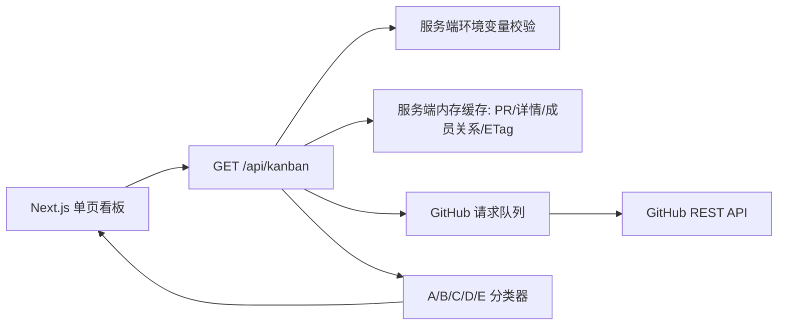

## Overview

### 产品功能

MVP 只面向 `nexu-io/open-design` 仓库，一个页面展示该仓库所有贡献者的 PR 状态。

过滤条件：
- 内部贡献者（组织成员）
- 外部贡献者
- 所有贡献者

刷新间隔设置：
- 5 分钟
- 10 分钟
- 30 分钟
- 60 分钟

看板分类（从上到下依次进行规则匹配）：
- A 未开始：PR 还是 Draft 状态
- B 不可合并：CI 未通过，或有代码冲突
- C 评审未通过：出现 CHANGE_REQUESTED
- E 可合并：PR 评审通过，可以合并
- D 处理中：不属于以上所有情况
看板布局，从左到右，分别是 A、B、C、D、E

看板元素中的信息：
- PR 编号（胶囊展示）
- 作者名（标注是内部还是外部）
- PR 标题（最多两行，多的用省略号）
- 细节状态（如「CI 未通过」「有 3 个文件冲突」「CHANGE_REQUESTED」「评审通过」等）
- 最后修改时间（PR 作者 commit 或者评论的最晚时间，展示人类易读的相对时间）
- 数据刷新时间（展示人类易读的相对时间）
- 立即刷新按钮

看板同一列中，元素按照最后更新时间倒序排列

### 技术实现

技术栈：
- TypeScript
- React + Tailwind + Next.js
- 前端是单页应用，不做跳转

后端处理逻辑（提供一个思路）：每次获取数据时，先获取所有 Open PR，放到一个队列里，根据 PR 修改时间排序。然后依次处理队列元素，从最新修改的 PR 开始，依次获取数据，并显示到看板上。
需要调研：
- 是否可以并行获取数据，rate limit 够不够
- 是否可以根据 GitHub PR 的最后修改时间进行缓存

## Research

### Existing System
- 仓库当前只有 `.git/` 与 `specs/`，没有应用代码、`package.json`、Next.js/Tailwind/TypeScript 配置或 GitHub API 集成；项目处于未初始化状态。Source: repository root directory listing, `specs/change/20260512-kanban-mvp/spec.md:44-54`
- 既定产品约束是单页看板：过滤内部/外部/全部贡献者、5/10/30/60 分钟刷新、按 A/B/C/D/E 规则分列、按最后更新时间倒序排序。Source: `specs/change/20260512-kanban-mvp/spec.md:12-42`
- MVP 目标仓库固定为 `nexu-io/open-design`；本阶段优先服务该仓库的 PR 看板体验。Source: `specs/change/20260512-kanban-mvp/spec.md:12`, `.env`
- 既定技术倾向是 TypeScript + React + Tailwind + Next.js，前端单页应用。Source: `specs/change/20260512-kanban-mvp/spec.md:44-49`

### Available Approaches
- **Next.js 单仓全栈实现**：Next.js App Router 使用 `app` 目录，`page.tsx` 暴露页面，`route.ts` 暴露 API 端点；Route Handlers 使用 Web `Request`/`Response` API，适合把 GitHub token 留在服务端。Source: https://nextjs.org/docs/app/getting-started/project-structure#routing-files, https://nextjs.org/docs/app/getting-started/route-handlers#route-handlers
- **Next.js 环境变量管理**：Next.js 从 `.env*` 加载变量到服务端 `process.env`；浏览器只能访问 `NEXT_PUBLIC_` 前缀变量，GitHub token 应作为服务端环境变量使用。Source: https://nextjs.org/docs/app/guides/environment-variables#loading-environment-variables, https://nextjs.org/docs/app/guides/environment-variables#bundling-environment-variables-for-the-browser
- **REST 拉取路径**：`GET /repos/{owner}/{repo}/pulls` 支持 `state=open`、`sort=updated`、`direction=desc`、`per_page<=100`，响应含 PR `number/title/user/head.sha/updated_at/draft/author_association` 等字段。Source: https://docs.github.com/en/rest/pulls/pulls#list-pull-requests
- **REST 补充端点**：PR 是 issue 类型，issue comments 需要走 Issues API；PR 详情、reviews、commits、checks/statuses、org membership 需要额外端点组合。Source: https://docs.github.com/en/rest/pulls/pulls#about-pull-requests, https://docs.github.com/en/rest/checks/runs#list-check-runs-for-a-git-reference, https://docs.github.com/en/rest/pulls/reviews#list-reviews-for-a-pull-request, https://docs.github.com/en/rest/orgs/members#get-organization-membership-for-a-user
- **GraphQL 拉取路径**：GitHub GraphQL API 比 REST 更精确灵活，可在一次查询中按字段选择 `PullRequest`、reviews、comments、commits、check suites 等连接；所有 connection 必须提供 `first` 或 `last`，单页取值范围 1-100。Source: https://docs.github.com/en/graphql, https://docs.github.com/en/graphql/guides/using-pagination-in-the-graphql-api#about-pagination
- **分页模型**：GraphQL 使用 cursor/pageInfo 翻页；REST PR list 使用 `per_page` 和 `page`，最大每页 100。Source: https://docs.github.com/en/graphql/guides/using-pagination-in-the-graphql-api#requesting-a-cursor-in-your-query, https://docs.github.com/en/rest/pulls/pulls#parameters
- **缓存模型**：REST 多数端点返回 `etag`，很多端点返回 `last-modified`；带 `Authorization` 的条件 GET 命中 `304 Not Modified` 时不计入 primary rate limit。Source: https://docs.github.com/en/rest/using-the-rest-api/best-practices-for-using-the-rest-api#use-conditional-requests-if-appropriate
- **事件驱动模型**：GitHub 官方建议订阅 webhook 事件来减少轮询；MVP 仍可用 5-60 分钟手动/定时刷新。Source: https://docs.github.com/en/rest/using-the-rest-api/best-practices-for-using-the-rest-api#avoid-polling, `specs/change/20260512-kanban-mvp/spec.md:19-23`

### Constraints & Dependencies
- REST 未认证 primary limit 是 60 requests/hour；使用 PAT、GitHub App user token 或 OAuth user token 时通常是 5,000 requests/hour。Source: https://docs.github.com/en/rest/using-the-rest-api/rate-limits-for-the-rest-api#primary-rate-limit-for-unauthenticated-users, https://docs.github.com/en/rest/using-the-rest-api/rate-limits-for-the-rest-api#primary-rate-limit-for-authenticated-users
- GraphQL primary limit 对用户通常是 5,000 points/hour；查询可通过 `rateLimit { cost remaining resetAt }` 或响应头观察成本和剩余额度。Source: https://docs.github.com/en/graphql/overview/rate-limits-and-node-limits-for-the-graphql-api#primary-rate-limit, https://docs.github.com/en/graphql/overview/rate-limits-and-node-limits-for-the-graphql-api#checking-the-status-of-your-primary-rate-limit
- Secondary rate limit 共享限制包括：REST+GraphQL 总并发最多 100；REST 单端点最多 900 points/min；GraphQL endpoint 最多 2,000 points/min；大多数 REST GET/HEAD/OPTIONS 和无 mutation 的 GraphQL 请求计 1 point。Source: https://docs.github.com/en/rest/using-the-rest-api/rate-limits-for-the-rest-api#about-secondary-rate-limits, https://docs.github.com/en/rest/using-the-rest-api/rate-limits-for-the-rest-api#calculating-points-for-the-secondary-rate-limit
- GitHub 官方最佳实践要求避免并发请求以降低 secondary limit 风险，建议用请求队列；遇到 rate limit 时按 `retry-after`、`x-ratelimit-reset` 或至少 1 分钟暂停，并在持续失败后指数退避和抛错。Source: https://docs.github.com/en/rest/using-the-rest-api/best-practices-for-using-the-rest-api#avoid-concurrent-requests, https://docs.github.com/en/rest/using-the-rest-api/best-practices-for-using-the-rest-api#handle-rate-limit-errors-appropriately
- GraphQL 单次调用必须满足 node limit：connection 必须给 `first`/`last`，取值 1-100，总节点数不能超过 500,000；复杂查询可能超时或触发资源限制，需要拆分。Source: https://docs.github.com/en/graphql/overview/rate-limits-and-node-limits-for-the-graphql-api#node-limit, https://docs.github.com/en/graphql/overview/rate-limits-and-node-limits-for-the-graphql-api#timeouts
- PR 的“最后修改时间”可直接用 PR `updated_at`/GraphQL `updatedAt` 做列表排序基础；需求中的“PR 作者 commit 或评论的最晚时间”还需要读取 PR commits 与 issue comments/review activity 后计算业务字段。Source: `specs/change/20260512-kanban-mvp/spec.md:38,42,51-54`, https://docs.github.com/en/rest/pulls/pulls#list-pull-requests

### Key References
- `specs/change/20260512-kanban-mvp/spec.md:12-54` - 产品规则、刷新间隔、初始技术栈和待调研问题。
- https://nextjs.org/docs/app/getting-started/project-structure - Next.js App Router 文件结构、`page`/`route` 约定。
- https://nextjs.org/docs/app/getting-started/route-handlers - Next.js 服务端 API Route Handlers。
- https://nextjs.org/docs/app/guides/environment-variables - Next.js 服务端/浏览器环境变量边界。
- https://docs.github.com/en/rest/pulls/pulls#list-pull-requests - REST open PR 列表、排序、分页和响应字段。
- https://docs.github.com/en/graphql/guides/using-pagination-in-the-graphql-api - GraphQL pagination 和 connection 限制。
- https://docs.github.com/en/rest/using-the-rest-api/rate-limits-for-the-rest-api - REST primary/secondary rate limit。
- https://docs.github.com/en/graphql/overview/rate-limits-and-node-limits-for-the-graphql-api - GraphQL points、node limit、timeout。
- https://docs.github.com/en/rest/using-the-rest-api/best-practices-for-using-the-rest-api - GitHub API 队列、缓存、rate limit 处理最佳实践。

## Design

### Architecture Overview



### Change Scope

- Area: 项目初始化。Impact: 新增 Next.js App Router、TypeScript、Tailwind、测试工具链和本地开发脚本。Source: repository root directory listing, `specs/change/20260512-kanban-mvp/spec.md:44-49,58-61`
- Area: 本地环境配置。Impact: 已创建 `.env` 并配置 `GITHUB_OWNER=nexu-io`、`GITHUB_REPO=open-design`、`GITHUB_ORG=nexu-io`、`GITHUB_TOKEN` 和 `GITHUB_REQUEST_CONCURRENCY=1`；`.gitignore` 已忽略 `.env`。Source: `.env`, `.gitignore`
- Area: 服务端 GitHub 聚合 API。Impact: 新增 `/api/kanban`，在服务端读取 GitHub token、owner/repo/org 配置并返回看板 DTO。Source: `specs/change/20260512-kanban-mvp/spec.md:51-54`, https://nextjs.org/docs/app/getting-started/route-handlers#route-handlers, https://nextjs.org/docs/app/guides/environment-variables#loading-environment-variables
- Area: GitHub 数据读取。Impact: 读取 open PR 列表、PR 详情、reviews、commits、issue comments、check runs/statuses、org membership，并按请求队列顺序执行。Source: https://docs.github.com/en/rest/pulls/pulls#list-pull-requests, https://docs.github.com/en/rest/pulls/pulls#about-pull-requests, https://docs.github.com/en/rest/checks/runs#list-check-runs-for-a-git-reference, https://docs.github.com/en/rest/pulls/reviews#list-reviews-for-a-pull-request, https://docs.github.com/en/rest/orgs/members#get-organization-membership-for-a-user
- Area: UI 看板。Impact: 单页面展示过滤器、刷新间隔选择、立即刷新、五列卡片、相对时间和错误状态。Source: `specs/change/20260512-kanban-mvp/spec.md:12-42`
- Area: MVP 仓库范围。Impact: 看板默认并优先服务 `nexu-io/open-design`，环境变量也指向该仓库；多仓库能力留到后续迭代。Source: `specs/change/20260512-kanban-mvp/spec.md:12`, `.env`
- Area: 缓存与限流。Impact: 使用 `updated_at` 排序、ETag 条件请求和低并发队列，缓存 scope 限于服务端运行进程。Source: `specs/change/20260512-kanban-mvp/spec.md:51-54`, https://docs.github.com/en/rest/using-the-rest-api/best-practices-for-using-the-rest-api#use-conditional-requests-if-appropriate, https://docs.github.com/en/rest/using-the-rest-api/best-practices-for-using-the-rest-api#avoid-concurrent-requests

### Design Decisions

- Decision: 采用 Next.js App Router 单仓全栈，页面在 `app/page.tsx`，服务端聚合接口在 `app/api/kanban/route.ts`。Source: `specs/change/20260512-kanban-mvp/spec.md:44-49`, https://nextjs.org/docs/app/getting-started/project-structure#routing-files, https://nextjs.org/docs/app/getting-started/route-handlers#route-handlers
- Decision: GitHub token、owner、repo、org 全部使用服务端环境变量：`GITHUB_TOKEN`、`GITHUB_OWNER`、`GITHUB_REPO`、`GITHUB_ORG`；缺失时 API 直接返回失败状态，UI 显示配置错误。Source: https://nextjs.org/docs/app/guides/environment-variables#loading-environment-variables, https://nextjs.org/docs/app/guides/environment-variables#bundling-environment-variables-for-the-browser
- Decision: MVP 使用 REST API 聚合，优先利用 REST `etag`/`last-modified` 条件请求减少 rate limit 消耗；GraphQL 保留为后续优化路径。Source: https://docs.github.com/en/rest/using-the-rest-api/best-practices-for-using-the-rest-api#use-conditional-requests-if-appropriate, https://docs.github.com/en/graphql/overview/rate-limits-and-node-limits-for-the-graphql-api#node-limit
- Decision: GitHub 请求通过服务端队列执行，默认并发为 1，可用 `GITHUB_REQUEST_CONCURRENCY` 调整到小值；遇到 rate limit 按响应头抛出可展示错误。Source: https://docs.github.com/en/rest/using-the-rest-api/best-practices-for-using-the-rest-api#avoid-concurrent-requests, https://docs.github.com/en/rest/using-the-rest-api/best-practices-for-using-the-rest-api#handle-rate-limit-errors-appropriately
- Decision: open PR 列表使用 `state=open&sort=updated&direction=desc&per_page=100` 分页获取，先展示最新更新 PR 的最终分类结果。Source: `specs/change/20260512-kanban-mvp/spec.md:42,51-54`, https://docs.github.com/en/rest/pulls/pulls#list-pull-requests, https://docs.github.com/en/rest/pulls/pulls#parameters
- Decision: MVP 固定读取 `nexu-io/open-design`，通过 `.env` 中的 `GITHUB_OWNER=nexu-io` 和 `GITHUB_REPO=open-design` 驱动；UI 暂无仓库切换入口。Source: `specs/change/20260512-kanban-mvp/spec.md:12`, `.env`
- Decision: 内部/外部贡献者判定使用 `GET /orgs/{org}/memberships/{username}` 并缓存 login 结果；404/非 active membership 归为外部。Source: `specs/change/20260512-kanban-mvp/spec.md:14-17`, https://docs.github.com/en/rest/orgs/members#get-organization-membership-for-a-user
- Decision: 卡片业务更新时间 `activityAt` 取 PR 作者最新 commit 时间、PR 作者 issue comment 时间、PR 作者 review 提交时间三者最大值；列表排序使用 `activityAt` 倒序。Source: `specs/change/20260512-kanban-mvp/spec.md:38,42,79`, https://docs.github.com/en/rest/pulls/pulls#about-pull-requests
- Decision: 分类规则按需求固定优先级执行：Draft → 不可合并 → CHANGE_REQUESTED → 可合并 → 处理中；每个分类返回 `detailStatus` 用于卡片展示。Source: `specs/change/20260512-kanban-mvp/spec.md:25-31,37`
- Decision: “不可合并”由失败/取消的 check/status 或 PR `mergeable === false` 触发；`mergeable === null` 归入处理中并显示“合并状态计算中”。Source: `specs/change/20260512-kanban-mvp/spec.md:27,30,37`, https://docs.github.com/en/rest/checks/runs#list-check-runs-for-a-git-reference
- Decision: UI 使用客户端组件管理筛选、刷新间隔和立即刷新；数据读取统一调用 `/api/kanban`，保持 token 只存在服务端。Source: `specs/change/20260512-kanban-mvp/spec.md:14-23,39-40`, https://nextjs.org/docs/app/guides/environment-variables#bundling-environment-variables-for-the-browser
- Decision: 失败状态作为一等 UI 状态展示，包括配置缺失、GitHub API 失败、rate limit 和数据解析失败；API 返回非 2xx 时前端展示错误详情并停止本轮刷新。Source: https://docs.github.com/en/rest/using-the-rest-api/best-practices-for-using-the-rest-api#handle-rate-limit-errors-appropriately

### Why this design

- 单仓 Next.js 能同时满足单页 React UI 与服务端 token 隔离，初始化成本低。
- REST 路径和当前需求字段直接对应，ETag 条件请求能支撑 5-60 分钟轮询。
- 队列优先于并行抓取，符合 GitHub secondary limit 最佳实践；MVP 可以先保证稳定性，再根据真实 PR 数量提高并发或切换 GraphQL。
- 分类器独立成纯函数，降低 GitHub API 聚合与 UI 展示之间的耦合，便于测试 A/B/C/D/E 优先级。

### Test Strategy

- Phase/area: 分类器单元测试。Validation: 覆盖 Draft、CI 失败、冲突、CHANGE_REQUESTED、可合并、处理中、优先级覆盖。Source: `specs/change/20260512-kanban-mvp/spec.md:25-31`
- Phase/area: DTO 构建单元测试。Validation: 覆盖 internal/external 筛选字段、`activityAt` 最大值计算、列内倒序排序、detailStatus 文案。Source: `specs/change/20260512-kanban-mvp/spec.md:14-42`
- Phase/area: GitHub client 测试。Validation: mock `fetch` 覆盖 ETag 304、非 2xx 抛错、rate limit 响应、分页、请求队列顺序。Source: https://docs.github.com/en/rest/using-the-rest-api/best-practices-for-using-the-rest-api#use-conditional-requests-if-appropriate, https://docs.github.com/en/rest/using-the-rest-api/best-practices-for-using-the-rest-api#handle-rate-limit-errors-appropriately
- Phase/area: API route 测试。Validation: 缺失 env 返回配置错误；成功聚合返回五列数据；GitHub 失败返回错误状态。Source: https://nextjs.org/docs/app/getting-started/route-handlers#route-handlers
- Phase/area: UI 组件测试。Validation: 过滤器切换、刷新间隔选择、立即刷新按钮、加载状态、错误状态、卡片两行截断样式存在。Source: `specs/change/20260512-kanban-mvp/spec.md:14-40`
- Phase/area: 手动验证。Validation: 配置真实仓库后运行本地页面，检查 open PR 分列、排序、刷新时间和错误展示。Source: `specs/change/20260512-kanban-mvp/spec.md:12-42`

### Pseudocode

Flow:
  1. UI 加载 `/api/kanban?refreshToken=<timestamp>`。
  2. API 校验 `GITHUB_TOKEN/GITHUB_OWNER/GITHUB_REPO/GITHUB_ORG`。
  3. API 分页拉取 open PR list，按 `updated_at desc` 遍历。
  4. 对每个 PR 经队列读取详情、reviews、commits、comments、checks/statuses、org membership。
  5. DTO builder 计算 `isInternal`、`activityAt`、`detailStatus`。
  6. classifier 按 A/B/C/D/E 优先级生成 `column`。
  7. API 返回 `{ refreshedAt, columns, rateLimit }`。
  8. UI 按筛选条件过滤卡片，并按刷新间隔重新请求。

Classifier:
  - if `draft`: A 未开始
  - else if failing check/status or `mergeable === false`: B 不可合并
  - else if latest meaningful review state has `CHANGE_REQUESTED`: C 评审未通过
  - else if approved and mergeable and required checks pass: E 可合并
  - else: D 处理中

### File Structure

- `package.json` - Next.js、React、TypeScript、Tailwind、测试脚本。
- `.env` - 本地 GitHub 仓库、组织、token 与请求并发配置。
- `.gitignore` - 忽略 `.env`、本地依赖、构建产物和覆盖率目录。
- `next.config.ts` - Next.js 配置。
- `tsconfig.json` - TypeScript 配置。
- `postcss.config.mjs` - Tailwind/PostCSS 配置。
- `app/layout.tsx` - 全局布局与样式入口。
- `app/page.tsx` - 看板页面。
- `app/globals.css` - Tailwind 与全局样式。
- `app/api/kanban/route.ts` - 看板聚合 API。
- `src/github/client.ts` - GitHub REST client、ETag 缓存、分页、错误处理。
- `src/github/queue.ts` - 低并发请求队列。
- `src/github/types.ts` - GitHub 响应最小类型。
- `src/kanban/types.ts` - 看板 DTO 与列定义。
- `src/kanban/classifier.ts` - A/B/C/D/E 分类器纯函数。
- `src/kanban/build-board.ts` - 聚合结果到看板 DTO 的转换。
- `src/config.ts` - 服务端 env 校验。
- `src/time.ts` - 相对时间格式化工具。
- `src/components/FilterControls.tsx` - 贡献者过滤和刷新间隔控制。
- `src/components/KanbanBoard.tsx` - 五列看板布局。
- `src/components/PullRequestCard.tsx` - PR 卡片。
- `src/components/RefreshStatus.tsx` - 刷新时间、加载和错误状态。
- `src/**/*.test.ts(x)` - 单元与组件测试。

### Interfaces / APIs

`GET /api/kanban`

Response 200:
```ts
type KanbanResponse = {
  refreshedAt: string
  columns: Array<{
    id: 'A' | 'B' | 'C' | 'D' | 'E'
    title: string
    cards: PullRequestCard[]
  }>
  rateLimit?: { remaining?: number; resetAt?: string }
}

type PullRequestCard = {
  number: number
  title: string
  url: string
  author: { login: string; isInternal: boolean }
  detailStatus: string
  activityAt: string
  updatedAt: string
  column: 'A' | 'B' | 'C' | 'D' | 'E'
}
```

Response 4xx/5xx:
```ts
type ErrorResponse = {
  error: string
  detail?: string
  retryAt?: string
}
```

### Edge Cases

- `GITHUB_*` 配置缺失：API 返回配置错误，UI 展示错误状态。
- GitHub rate limit：API 返回错误与可用的 reset/retry 时间，UI 停止本轮刷新。
- `mergeable === null`：卡片进入处理中并显示“合并状态计算中”。
- PR 没有 comments/reviews：`activityAt` 使用最新 PR 作者 commit 时间，仍缺失时使用 PR `updated_at`。
- 超过 100 个 open PR：REST PR list 继续分页，保留 `updated_at desc` 处理顺序。
- membership 404：作者归为外部贡献者。
- check runs 与 statuses 混用：任一失败/取消状态触发不可合并。
- 同一 PR 同时满足多条规则：按 A/B/C/D/E 优先级选择最先命中的列。

## Plan

- [x] Step 1: 初始化 Next.js + 测试基础
  - [x] Substep 1.1 Implement: 创建 Next.js App Router、TypeScript、Tailwind、基础布局和脚本，保留现有 `.env` 与 `.gitignore`。
  - [x] Substep 1.2 Implement: 配置 Vitest/Testing Library 与基础测试命令。
  - [x] Substep 1.3 Implement: 创建 `src/config.ts` 并实现服务端 env 校验。
  - [x] Substep 1.4 Verify: 运行 lint/typecheck/test，确认空应用和 env 校验测试通过。
- [x] Step 2: 实现 GitHub 数据层
  - [x] Substep 2.1 Implement: 实现 REST client、分页、ETag 缓存、非 2xx 错误和 rate limit 错误。
  - [x] Substep 2.2 Implement: 实现低并发请求队列和 org membership 缓存。
  - [x] Substep 2.3 Implement: 实现 open PR、详情、reviews、commits、comments、checks/statuses 数据读取函数。
  - [x] Substep 2.4 Verify: 用 mocked fetch 覆盖分页、304、rate limit、队列顺序、membership 404。
- [x] Step 3: 实现看板聚合 API
  - [x] Substep 3.1 Implement: 定义看板 DTO、列常量和 TypeScript 类型。
  - [x] Substep 3.2 Implement: 实现 `activityAt`、internal/external、detailStatus 构建逻辑。
  - [x] Substep 3.3 Implement: 实现 A/B/C/D/E 分类器和 `/api/kanban` route。
  - [x] Substep 3.4 Verify: 覆盖分类优先级、排序、配置缺失、GitHub 失败和成功响应测试。
- [x] Step 4: 实现单页看板 UI
  - [x] Substep 4.1 Implement: 实现过滤器、刷新间隔选择和立即刷新按钮。
  - [x] Substep 4.2 Implement: 实现五列看板、PR 卡片、两行标题截断、内部/外部标记、相对时间。
  - [x] Substep 4.3 Implement: 实现加载、刷新中、上次刷新时间和错误状态。
  - [x] Substep 4.4 Verify: 覆盖过滤、刷新、错误展示、卡片字段渲染的组件测试。
- [ ] Step 5: 集成验证与稳定化
  - [ ] Substep 5.1 Implement: 添加 `.env.example` 和 README 本地运行说明，避免提交真实 `.env` token。
  - [ ] Substep 5.2 Verify: 运行 lint/typecheck/test/build。
  - [ ] Substep 5.3 Verify: 使用真实 GitHub 仓库配置进行本地手动验证。
  - [ ] Substep 5.4 Verify: 记录验证结果与实现偏差到 Notes。

## Notes

<!-- Optional sections — add what's relevant. -->

### Implementation

- `.env` - 已配置 GitHub 目标仓库 `nexu-io/open-design`、组织 `nexu-io`、本地 token 和请求并发。
- `.gitignore` - 已忽略 `.env`、`.env*.local`、依赖、构建产物和覆盖率目录。
- `package.json` / `package-lock.json` - 新增 Next.js、React、TypeScript、Tailwind、Vitest、Testing Library、ESLint 依赖与脚本。
- `app/layout.tsx` / `app/page.tsx` / `app/globals.css` - 新增 App Router 基础页面、全局布局和 Tailwind 样式入口。
- `next.config.ts` / `tsconfig.json` / `postcss.config.mjs` / `tailwind.config.ts` / `eslint.config.mjs` / `vitest.config.ts` / `vitest.setup.ts` - 新增框架、样式、Lint 和测试配置。
- `src/config.ts` - 新增服务端 GitHub env 校验，缺失必填配置或非法并发值时抛出 `ConfigError`。
- `src/config.test.ts` / `app/page.test.tsx` - 覆盖 env 校验和初始化页面渲染。
- `src/github/types.ts` - 新增 GitHub REST 最小响应类型，覆盖 PR、reviews、commits、comments、check runs、statuses、membership 和 rate limit 元信息。
- `src/github/queue.ts` - 新增 fail-fast 的低并发 FIFO 请求队列，非法并发值直接抛错，请求失败原样传播。
- `src/github/client.ts` - 新增 GitHub REST client，统一请求头、分页、ETag/Last-Modified 内存缓存、304 命中回包、非 2xx / rate limit 错误封装和 org membership 缓存。
- `src/github/client.test.ts` - 新增 mocked fetch 测试，覆盖分页、304 命中缓存、304 缺缓存报错、非 2xx、rate limit retryAt、队列顺序、membership 404 与缓存。
- `src/kanban/types.ts` - 新增看板列常量、DTO 类型、卡片类型和错误响应类型。
- `src/kanban/classifier.ts` - 新增 A/B/C/D/E 分类器，按 Draft、不可合并、CHANGE_REQUESTED、可合并、处理中优先级返回列和 detailStatus。
- `src/kanban/build-board.ts` - 新增 GitHub 数据聚合到看板 DTO 的构建逻辑，计算 internal/external、activityAt 并按列内 activityAt 倒序排序。
- `app/api/kanban/route.ts` - 新增 `/api/kanban` route，校验服务端配置、创建 GitHub client、返回看板响应，并显式返回配置错误和 GitHub API 错误。
- `src/kanban/classifier.test.ts` / `src/kanban/build-board.test.ts` / `app/api/kanban/route.test.ts` - 覆盖分类优先级、卡片构建排序、配置缺失、GitHub 失败和成功响应。
- `vitest.config.ts` - 新增 `@` 路径别名配置，保证 route 和源文件在测试环境可解析。
- `app/page.tsx` - 改为渲染客户端看板页面组件。
- `src/components/KanbanPage.tsx` - 新增单页看板状态管理，读取 `/api/kanban`，支持贡献者过滤、刷新间隔、立即刷新、自动轮询、加载/刷新中和错误状态。
- `src/components/FilterControls.tsx` - 新增内部/外部/全部过滤器、5/10/30/60 分钟刷新间隔选择和立即刷新按钮。
- `src/components/KanbanBoard.tsx` / `src/components/PullRequestCard.tsx` - 新增五列看板与 PR 卡片，展示编号、作者、内部/外部标记、两行标题截断、细节状态和相对时间。
- `src/components/RefreshStatus.tsx` - 新增上次刷新、刷新中、rate limit 与 API 错误展示。
- `src/time.ts` - 新增中文相对时间格式化工具。
- `app/page.test.tsx` - 更新组件测试，mock `/api/kanban` 响应，覆盖初始加载、卡片字段、过滤切换、立即刷新、错误展示和刷新间隔自动轮询。
- `app/globals.css` - 补充页面字体渲染和选择框暗色主题样式。

### Verification

<!-- How the feature was verified: tests written, manual testing steps, results -->
- `npm run lint` - passed。
- `npm test` - passed，6 个测试文件、26 个测试；覆盖 Step 4 单页 UI 加载、字段渲染、过滤、刷新、错误状态和刷新间隔。
- `npm run typecheck` - passed。
- `npm run lint` - passed。
- `npm run typecheck` - passed。
- `npm test` - passed，2 个测试文件、5 个测试。
- `npm run build` - passed。
- `npm test` - passed，3 个测试文件、12 个测试；覆盖 GitHub 数据层分页、304 缓存、rate limit、队列顺序和 membership 404/caching。
- `npm run typecheck` - passed。
- `npm run lint` - passed。
- `npm test` - passed，6 个测试文件、21 个测试；覆盖 Step 3 分类器、看板 DTO 构建和 API route 错误/成功响应。
- `npm run typecheck` - passed。
- `npm run lint` - passed。
